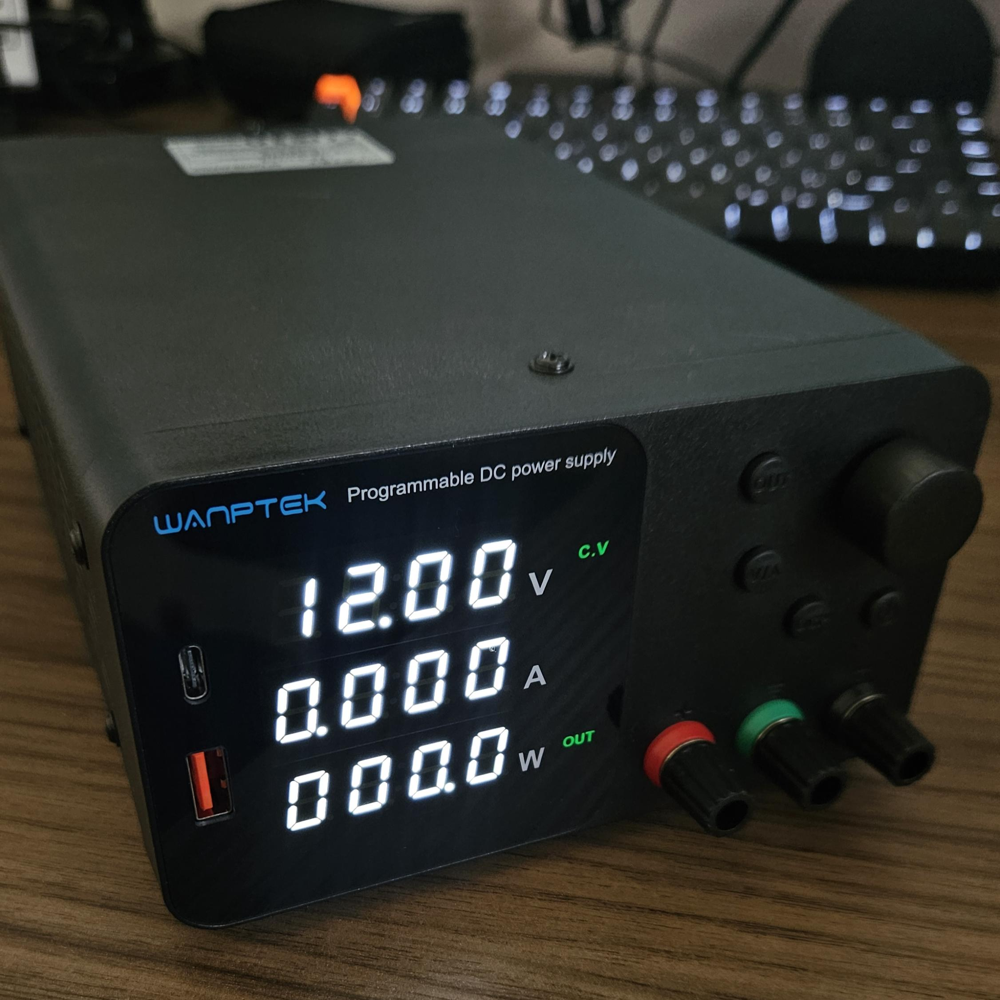
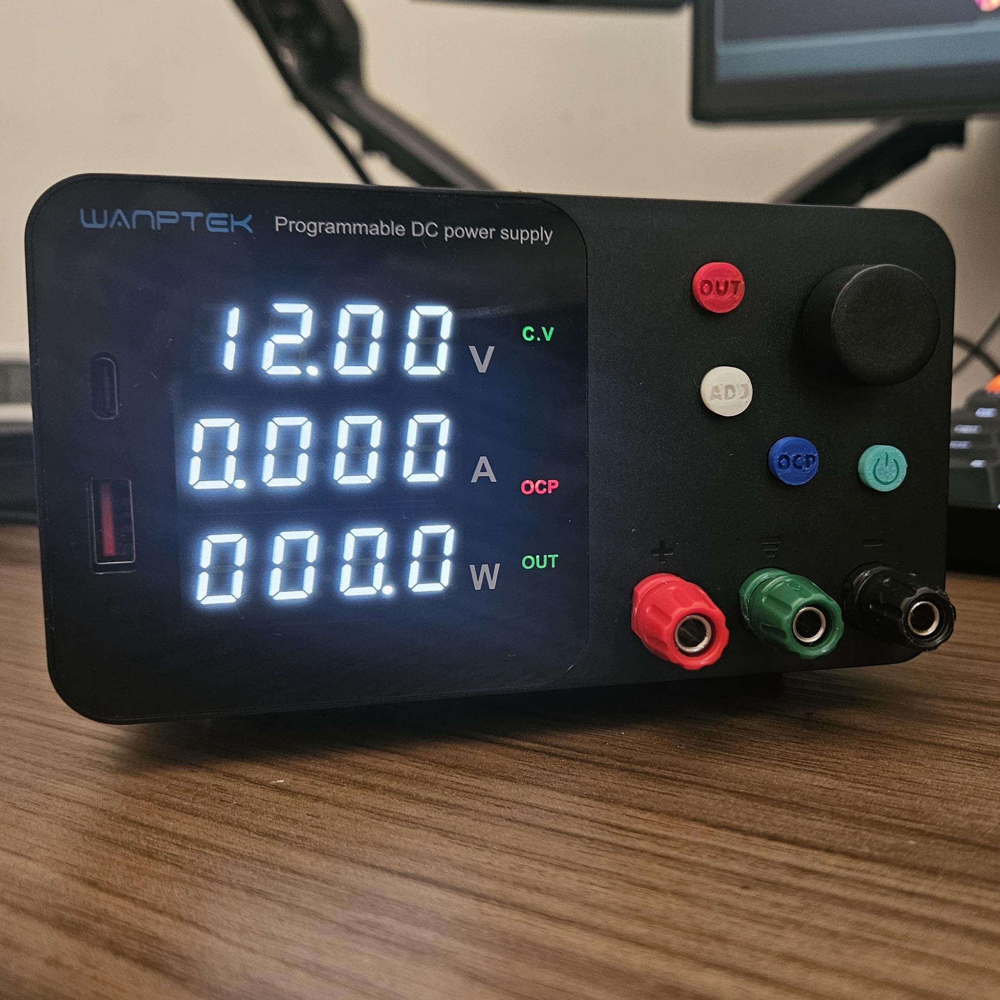
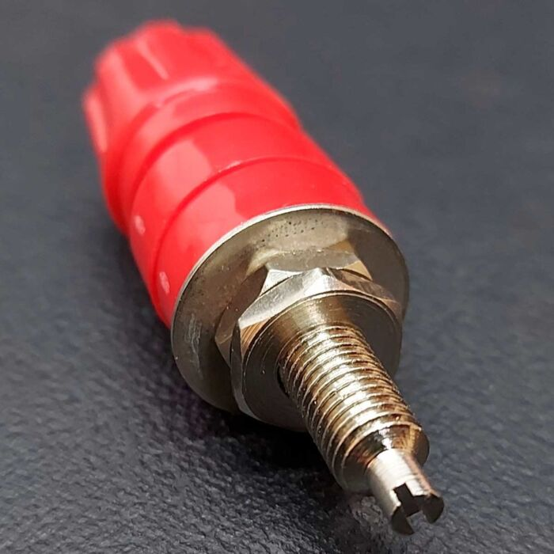
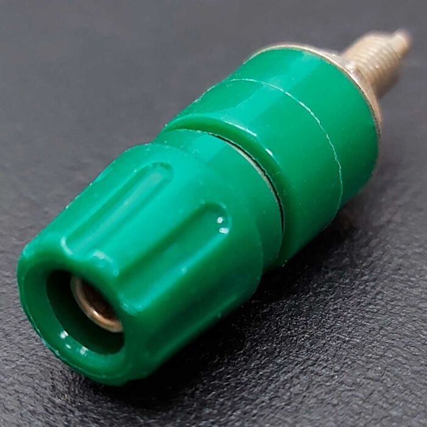
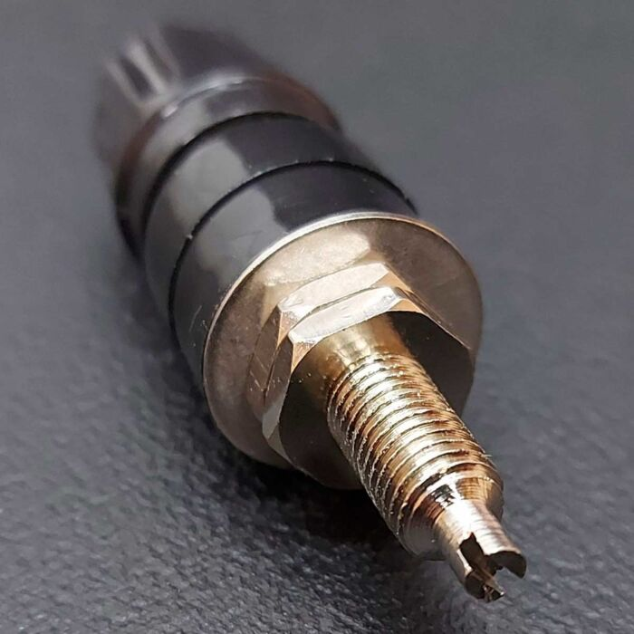

# Wanptek TPS3010 Upgrades

These are the modifications I made to my Wanptek TPS3010 power supply to enhance its usability in daily tasks. The main objectives were to improve its aesthetics and enhance button visibility.

|  |  |
|--------------------------------------------------|--------------------------------------------------|
| Before (Original)                                | After (With Upgrades)                            |

---

### Key Improvements:
1. **Aesthetic Design**: Achieved a cleaner and more modern look.
2. **Button Visibility**: Enhanced for easier and more intuitive operation.

---

## 4mm Banana Jacks

For the upgrade, I used **4mm B19 Banana Jacks** from **BBC Tech**.

|  |  |
|------------------------------------------|------------------------------------------|
|                                  |                                  |

|  |  |
|----------------------------------------------|----------------------------------------------|
|                                      |                                      |

|  |  |
|----------------------------------------------|----------------------------------------------|
|                                      |                                      |

---

### Additional Notes
- The upgraded jacks provide better durability and electrical contact.
- The color-coded design aligns with the overall aesthetics of the power supply.
